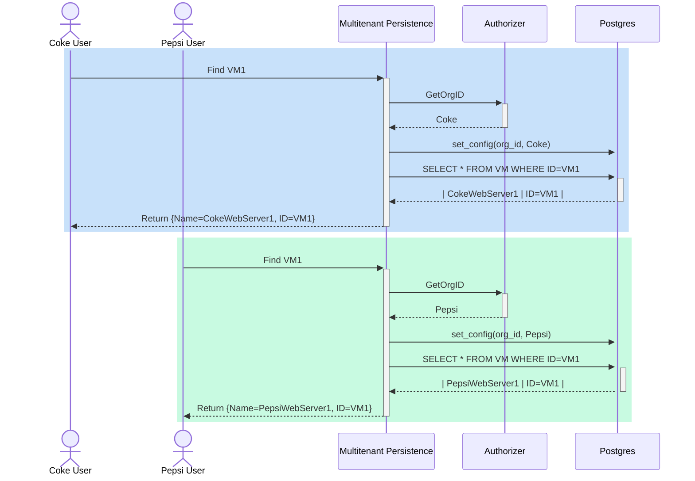

# multi-tenant-persistence-for-saas

## Overview

Multi-tenant Persistence for SaaS services acts as data abstraction layer for
underlying data store (Postgres) and provide multi-tenancy
capabilities along with ability to integrate with different IAM authorizers.

## Introduction

This repo contains an implementation of a data access layer (DAL) that will be
used by SaaS microservices. It is a Go library that could be used in other
projects and supports data store backed by a Postgres database.

A sample use case for a multi-tenant application using this library to read VM
information stored in a Postgres database:

## Features

Currently, following features are supported:

- **CRUD operations** on persisted objects, where data is persisted in Postgres
  database
- **Role-based access control (RBAC)**.
- **Metadata support** like CreatedAt, UpdatedAt, DeletedAt (using gorm.Model)
- **Versioning**. If a record persisted in data store has a field named
  _revision_, versioning (revisioning) will be supported on that table. Among
  multiple concurrent updates, only one will succeed.
- **Multi-tenancy**. DAL uses row-level security (RLS) feature of Postgres and
  a pluggable `Authorizer` interface to support multi-tenancy. User's with
  tenant-specific roles (`TENANT_WRITER`, `TENANT_READER`) will be able to
  access only their own tenant's data.

## Documentation

Following interfaces are exposed by the Golang library to be consumed by the user of this library,

### [Authorizer](docs/DOCUMENTATION.md#authorizer)

### [DataStore](docs/DOCUMENTATION.md#datastore)

### [ProtoStore](docs/DOCUMENTATION.md#protostore)

## Getting Started

## Future Support

- Some of the topics that require further discussion are the following:
    - Do we want to provide functionality for microservices to subscribe for updates in certain tables?
    - Do we need to provide pagination or streaming support using channels?

## Contributing

The multi-tenant-persistence-for-saas project team welcomes contributions from the community. Before you start
working with multi-tenant-persistence-for-saas, please read our [CONTRIBUTING.md](CONTRIBUTING_CLA.md). All
contributions to this repository must be signed as described on that page. Your signature certifies that you
wrote the patch or have the right to pass it on as an open-source patch. For more detailed information,
refer to [CONTRIBUTING.md](CONTRIBUTING_CLA.md).

## License

Refer to [LICENSE](./LICENSE)
