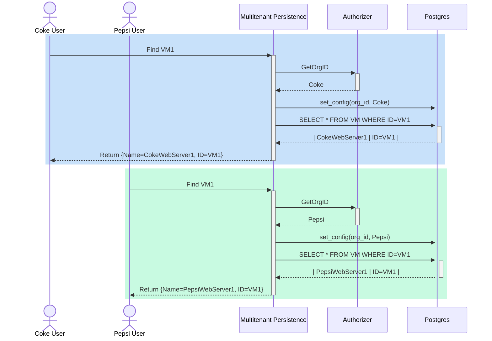

# multi-tenant-persistence-for-saas

## Overview

Multi-tenant Persistence for SaaS services acts as data abstraction layer for
underlying data store (Postgres/in-memory) and provide multi-tenancy
capabilities along with ability to integrate with different IAM authorizers.

## Introduction

This repo contains an implementation of a data access layer (DAL) that will be
used by SaaS microservices. It is a Go library that could be used in other
projects and supports data store backed by a Postgres database or an in-memory
cache.

A sample use case for a multi-tenant application using this library to read VM
information stored in a Postgres database:



## Features

Currently, DAL supports CRUD operations on persisted objects, where data is
persisted in Postgres database or in-memory cache, depending on library user's
choice.

- **CRUD operations** on persisted objects, where data is persisted in Postgres
  database or in-memory cache, depending on library user's choice
- **Role-based access control (RBAC)**.

DAL uses 4 database roles/users to perform all operations:

- _TENANT_READER_ - has read access to its tenant's data
- _READER_ - has read access to all tenants' data
- _TENANT_WRITER_ - has read & write access to its tenant's data
- _WRITER_ - has read & write access to all tenants' data

DAL allows to map a user's service role to the DB role that will be used for
that user. If a user has multiple service roles which map to several DB roles,
the DB role with the most extensive privileges will be used (see `Less()` method
for `DbRoleSlice` for details).

- **Multi-tenancy**. DAL uses row-level security (RLS) feature of Postgres and
  a pluggable `Authorizer` interface to support multi-tenancy. User's with
  tenant-specific roles (_TENANT_WRITER_, _TENANT_READER_) will be able to
  access only their own tenant's data.
- **Versioning**. If a record persisted in data store has a field named
  __revision_, versioning (revisioning) will be supported on that table. Among
  multiple concurrent updates, only one will succeed.

Work in progress:

- **Metadata support**

### Prerequisites

- [Golang](https://go.dev/)
- [Postgres](https://www.postgresql.org/) or any similar database
- [Make](https://man7.org/linux/man-pages/man1/make.1.html)

### Build & Run

- For building the code, run `make build`
- For linting the code, run `make lint`
- For running unit tests, run `make unit_tests`

## Documentation

Following interfaces are exposed by the Golang library to be consumed by the user of this library,

### Record

DAL exposes Record interface to be implemented by user:

```go
type Record interface {
    GetId() []interface{}
}
```

This interface represents an object persisted in a data store and will need to be implemented by the library user.

`GetId()` method should return a unique identifier of the object.

Each field in the struct implementing the `Record` interface must be exposed and
have `db_column` tag, whose value will be used to name the equivalent column of
the database. Additionally, there must be one or more fields with `primary_key`
tag, which will serve as the primary key of the equivalent database table. If
there are multiple fields tagged with `primary_key`, then the primary key will
be composite, and the order of columns in the composite key will be the same as
the order of the `primary_key` fields in the Golang struct. If a table is
supposed to be multi-tenant, the struct has to have a field with *org_id* as the
value of `db_column` tag. Org. ID will be part of the primary key by default.

### DataStore

DAL exposes `DataStore` interface to be consumed by the user to persist data in a cache or database:

```go
type dataStore interface {
    GetAuthorizer() Authorizer
    Configure(ctx context.Context, isDataStoreInMemory bool, authorizer Authorizer)
    PerformJoinOneToMany(ctx context.Context, record1 Record, record1Id string, record2JoinOnColumn string, query2Output interface{}) error
    PerformJoinOneToOne(ctx context.Context, record1 Record, record1Id string, record2 Record, record2JoinOnColumn string) error
    Find(ctx context.Context, record Record) error
    FindAll(ctx context.Context, records interface{}) error
    FindWithFilter(ctx context.Context, record Record, records interface{}) error
    Insert(ctx context.Context, record Record) (int64, error)
    Delete(ctx context.Context, record Record) (int64, error)
    Update(ctx context.Context, record Record) (int64, error)
    RegisterWithDAL(ctx context.Context, roleMapping map[string]DbRole, record Record) error
    Reset()
}
```

The library has 2 implementations of this interface - one backed by an in-memory cache, and one backed by a Postgres database (default option).

All the methods in the library, except for `Reset()`, accept a Golang Context as the first argument, which is used to support multi-tenancy and RBAC.

### ProtoStore

DAL also exposes `ProtoStore` interface to the user, which is a wrapper around `DataStore` and is used specifically to persist Protobuf messages:

```go
type ProtoStore interface {
    Register(ctx context.Context, roleMapping map[string]DbRole, msgs ...proto.Message) error
    Insert(ctx context.Context, id string, msg proto.Message) (rowsAffected int64, md Metadata, err error)
    Update(ctx context.Context, id string, msg proto.Message) (rowsAffected int64, md Metadata, err error)
    FindById(ctx context.Context, id string, msg proto.Message, metadata *Metadata) error
    FindAll(ctx context.Context, msgs interface{}) (metadataMap map[string]Metadata, err error)
    FindAllAsMap(ctx context.Context, msgsMap interface{}) (metadataMap map[string]Metadata, err error)
    DeleteById(ctx context.Context, id string, msg proto.Message) (rowsAffected int64, err error)

    InsertWithMetadata(ctx context.Context, id string, msg proto.Message, metadata Metadata) (rowsAffected int64, md Metadata, err error)
    UpdateWithMetadata(ctx context.Context, id string, msg proto.Message, metadata Metadata) (rowsAffected int64, md Metadata, err error)

    GetMetadata(ctx context.Context, id string, msg proto.Message) (md Metadata, err error)
    GetRevision(ctx context.Context, id string, msg proto.Message) (rowsAffected int64, err error)

    Configure(ctx context.Context, isDataStoreInMemory bool, authorizer Authorizer)
    GetAuthorizer() Authorizer
    DropTables(msgs ...proto.Message) error
}
```

Just as with `DataStore`, Protobuf messages can be persisted either in a cache or Postgres DB. All the Protobuf messages persisted using `ProtoStore` will support versioning and multi-tenancy.

### Authorizer

DAL exposes `Authorizer` interface that is used to determine user's org. ID and permit or deny operations on the data store:

```go
type Authorizer interface {
    GerOrgFromContext(ctx context.Context) (string, error)
    GetMatchingDbRole(ctx context.Context, tableName string) (DbRole, error)
    IsOperationAllowed(ctx context.Context, tableName string, record Record) error
    Configure(args ...interface{})
}
```

`MetadataBasedAuthorizer`: DAL provides basic implementation of `Authorizer` interface using metadata from GRPC context.
Currently, allows users to read & write data based on following roles,

- `service_admin`: WRITER
- `service_auditor`: READER
- `tenant_admin`: TENANT_WRITER
- `tenant_auditor`: TENANT_AUDITOR

It is possible for the library user to provide their own implementation of `Authorizer` interface using `Configure()`.

## Getting Started

Import the package and use `DataStore` object to interact with the data access
layer. If you want DAL to use a Postgres database, ensure you have the following
environment variables set to relevant values: *DB_ADMIN_USERNAME*, *DB_PORT*,
*DB_NAME*, *DB_ADMIN_PASSWORD*, *DB_HOST*, *SSL_MODE*. You can also set
*LOG_LEVEL* environment variable if you want logging at a specific level
(default is _Info_)

### DataStore Example

1) Import the package in your microservice

```go
import "github.com/vmware-labs/multi-tenant-persistence-for-saas/data-access-layer/datastore"
```

2) Define structs that will be persisted. Ensure each field is exported (capitalized) and contains a *db_column* tag,
whose value will be considered to be the name of the relevant column in DB table.

- At least one field must be a primary key (contain a *primary_key* tag with the value of *true*).
- For revision support to block concurrent updates, add __revision_ db column tag.
- For multi-tenancy support, add an _org_id_ tag to a field.

```go
type app struct {
    Id    string `db_column:"app_id" primary_key:"true"`
    Name  string `db_column:"name"`
    OrgId string `db_column:"org_id"` //Part of the primary key by default
}

type appUser struct {
    Id             string `db_column:"id" primary_key:"true"`
    Name           string `db_column:"name"`
    Email          string `db_column:"email"`
    EmailConfirmed bool   `db_column:"email_confirmed"`
    NumFollowing   int32  `db_column:"num_following"`
    AppId          string `db_column:"app_id"`
}
```

3) Implement all the methods of the `Record` interface

```go
func (myApp app) GetId() []interface{} {
    return []interface{}{myApp.Id, myApp.OrgId}
}

func (myAppUser appUser) GetId() []interface{} {
    return []interface{}{myAppUser.Id}
}
```

4) Use `DataStore` object from the package to interact with datastore. When microservice starts up, do the following:

- (Optional) Call `Configure()` method to choose an in-memory cache for persistence instead of the default Postgres
- (Optional) Use `Configure()` to provide an authorizer different from the default (`MetadataBasedAuthorizer`).
- Call `RegisterWithDAL()` for every struct whose data needs to be persisted. If using `MetadataBasedAuthorizer`, pass a map that would show which DB roles to use for your future users' service roles.

```go
rand.Seed(time.Now().Unix())

myApp := app{
    Id:   "id-" + strconv.Itoa(rand.Int()),
    Name: "Cool_app",
    OrgId: "Coke",
}

user1 := appUser{
    Id:             "id-" + strconv.Itoa(rand.Int()),
    Name:           "FooUser",
    Email:          "foouser@mail.com",
    EmailConfirmed: true,
    NumFollowing:   100,
    AppId:          myApp.Id,
}

datastore.DataStore.Configure(context.TODO(), false /* isDataStoreInMemory */, DataStore.GetAuthorizer()) //For an in-memory cache, pass true as the second argument

//Service roles
const SERVICE_ADMIN = "service_admin"
const APP_ADMIN = "app_admin"

//Register the struct "app" with datastore. App admin. will have write access to his org's apps
roleMappingForApp := map[string]DbRole{
    APP_ADMIN:     datastore.TENANT_WRITER,
    SERVICE_ADMIN: datastore.WRITER,
}
DataStore.RegisterWithDAL(context.TODO(), roleMappingForApp, app{})

//Register the struct "appUser" with datastore. App admin. will have read access to all users
roleMappingForAppUser := map[string]DbRole{
    APP_ADMIN:     datastore.READER,
    SERVICE_ADMIN: datastore.WRITER,
}
DataStore.RegisterWithDAL(context.TODO(), roleMappingForAppUser, appUser{})

datastore.DataStore.Insert(ctx, user1)
var queryResult appUser = appUser{Id: user1.Id} //Could also declare it as Record but that would require additional casting subsequently
DataStore.Find(ctx, &queryResult)

queryResults := make([]appUser, 0)
DataStore.FindAll(ctx, &queryResults)

var queryResult1 app = app{}
var queryResult2 []appUser = make([]appUser, 0)
DataStore.PerformJoinOneToMany(ctx, &queryResult1, myApp.Id, "app_id", &queryResult2)

var queryResult3 app = app{}
var queryResult4 appUser = appUser{}
DataStore.PerformJoinOneToOne(ctx, &queryResult3, myApp.Id, &queryResult4, "app_id")

//Update the record several times
user1 = appUser{Id: user1.Id}
DataStore.Find(ctx, &user1) //Re-read the record from DB to ensure you have the most up-to-date revision
updatedUser1 := user1
updatedUser1.NumFollowing++
DataStore.Update(ctx, updatedUser1)

user1 = appUser{Id: user1.Id}
DataStore.Find(ctx, &user1)
updatedUser1 = user1
updatedUser1.NumFollowing++
DataStore.Update(ctx, updatedUser1)
```

### ProtoStore Example

1) Import the package in your microservice

```go
import "github.com/vmware-labs/multi-tenant-persistence-for-saas/data-access-layer/datastore"
```

2) Use `datastore.GetProtoStore()` function to interact with ProtoStore. When microservice starts up, do the following:

- (Optional) Call `Configure()` method to choose an in-memory cache for persistence instead of the default Postgres
- (Optional) Use `Configure()` to provide an authorizer different from the default (`MetadataBasedAuthorizer`).
- Call `Register()` for every Protobuf message whose data needs to be persisted. If using `MetadataBasedAuthorizer`, pass a map that would show which DB roles to use for your future users' service roles.

```protobuf
message Memory {
  string brand = 1;
  uint32 size = 2;
  uint32 speed = 3;
  string type = 4;
}
```

```go
roleMappingForMemory := map[string]DbRole{
  APP_ADMIN:     datastore.READER,
  SERVICE_ADMIN: datastore.WRITER,
}

protoStore := datastore.GetProtoStore()
protoStore.Configure(context.TODO(), false /* isDataStoreInMemory */, protoStore.GetAuthorizer())
protoStore.Register(context.TODO(), roleMappingForMemory, &pb.Memory{})

id := "001"
memory := pb.Memory{
  Brand: "Samsung",
  Size:  32,
  Speed: 2933,
  Type:  "DDR4",
}
protoStore.Insert(ctx, id, &memory)

memory = pb.Memory{}
var metadata = Metadata{}
protoStore.FindById(ctx, id, &memory, &metadata)

memory.Speed++
protoStore.UpdateWithMetadata(ctx, id, &memory, metadata)

{
    var queryResults = make([]pb.Memory, 0) //make([]*pb.Memory, 0) would have worked too
    metadataMap, _ := protoStore.FindAll(ctx, &queryResults)
    //You can expect both queryResults &  metadataMap to be of size 1 and contain the existing record's data/metadata
}

{
    var queryResults = make(map[string]pb.Memory) //make(map[string]*pb.Memory) would have worked too
    metadataMap, _ := protoStore.FindAllAsMap(ctx, queryResults)
    //You can expect both queryResults &  metadataMap to be of size 1 and contain the existing record's data/metadata
}

memory.Speed++
protoStore.Update(ctx, id, memory) //Update() will automatically use the correct revision and avoid conflicting update errors

protoStore.DeleteById(ctx, id, &pb.Memory{})
```

## Future Support

- Right now, the persisted objects should only contain exported fields. Supported data types are the following:
  - string
  - bool
  - int8
  - int16
  - int32
  - int64
  - int
- Currently, nested structures and structures containing pointers are not supported and cannot be used to represent the persisted entities
- Some of the topics that require further discussion are the following:
  - Do we want to provide functionality for microservices to subscribe for updates in certain tables?
  - Will microservices need more advanced queries that are not supported by DAL? Do we want to return DB connection object to microservices so that they run their own queries?

## Contributing

The multi-tenant-persistence-for-saas project team welcomes contributions from the community. Before you start working with multi-tenant-persistence-for-saas, please
read our [Developer Certificate of Origin](https://cla.vmware.com/dco). All contributions to this repository must be
signed as described on that page. Your signature certifies that you wrote the patch or have the right to pass it on
as an open-source patch. For more detailed information, refer to [CONTRIBUTING.md](CONTRIBUTING_CLA.md).

## License

Refer to [LICENSE](./LICENSE)
