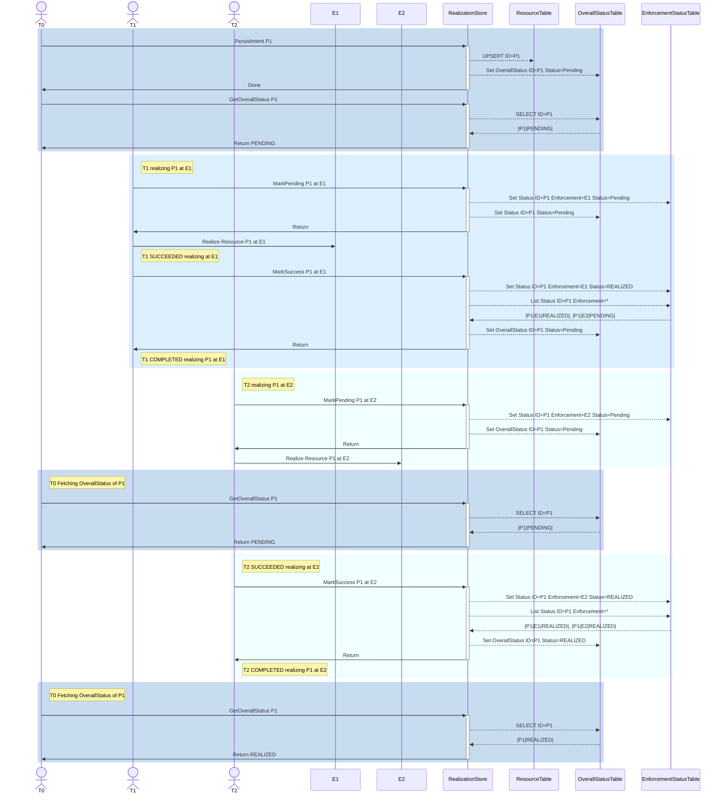

# multi-tenant-persistence-for-saas

## Overview

Multi-tenant Persistence for SaaS services acts as data abstraction layer for
underlying data store (Postgres) and provide multi-tenancy
capabilities along with ability to integrate with different IAM authorizers.

## Introduction

This repo contains an implementation of a data access layer (DAL) that will be
used by SaaS microservices. It is a Go library that could be used in other
projects and supports data store backed by a Postgres database.

A sample use case for a multi-tenant application using this library to read VM
information stored in a Postgres database:

Sample use case of the realization store where two threads T1, T2 that are parallelly
realizing the resource that just got updated at two different enforcement points
E1, E2 looks as follows,

Note that in the scenarios above, it is not necessary for the consumers of
`IRealizationStore` to be the same software component.

## Features

Currently, following features are supported:

- **CRUD operations** on persisted objects, where data is persisted in Postgres
  database

- **Multi-tenancy** persistence is supported with `org_id` as the column used
 .for accessing data for different tenants using row-level security (RLS)
  feature of Postgres. A pluggable `Authorizer` interface to support multi-tenancy.
  User's with tenant-specific roles (`TENANT_WRITER`, `TENANT_READER`) will be
  able to access only their own tenant's data.

- **Role-based access control (RBAC)** based on the role mappings from the
 .user to DBRole Mappings.

- **Metadata support** like CreatedAt, UpdatedAt, DeletedAt (using `gorm.Model`)

- **Revisioning** is supported if a record being persistent has a field named
 .`revision`. Among concurrent updates on same revision of the record only
 .one of the operations would succeed.

- **Multi-instance** persistence is supported with `instance_id` as the column used
  for accessing data for different deployment instances using row-level security
  (RLS) feature of Postgres. `Instancer` interface is used to support multi-instances.
 .If instancer is not configured `instance_id` column doesnt have any special meaning
 .and treated as normal attribute.

## Documentation

Refer to [DOCUMENTATION.md](docs/DOCUMENTATION.md) for the interfaces exposed like
`Datastore`, `Authorizer`, `Protostore`, `Realization Store`

## Future Support

- Support for services to subscribe for updates to tables.

## Contributing

The multi-tenant-persistence-for-saas project team welcomes contributions from the
community. Before you start working with multi-tenant-persistence-for-saas, please
read our [CONTRIBUTING.md](CONTRIBUTING_CLA.md). All contributions to this repository
must be signed as described on that page. Your signature certifies that you wrote
the patch or have the right to pass it on as an open-source patch. For more detailed
information, refer to [CONTRIBUTING.md](CONTRIBUTING_CLA.md).

## License

Refer to [LICENSE](./LICENSE)
